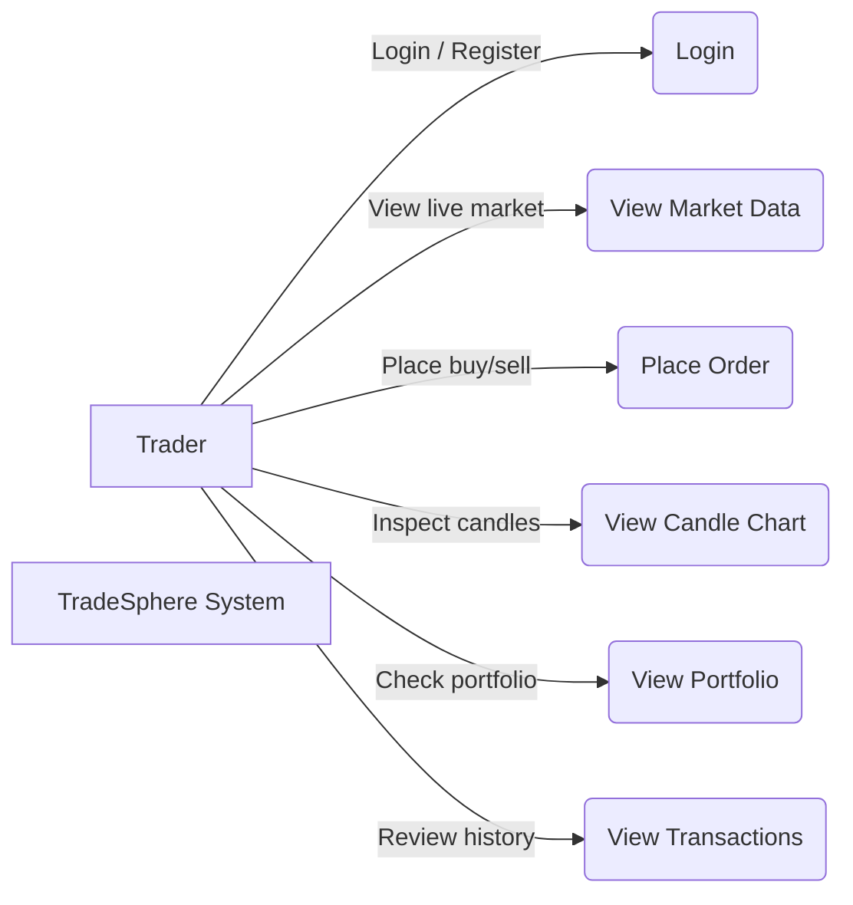
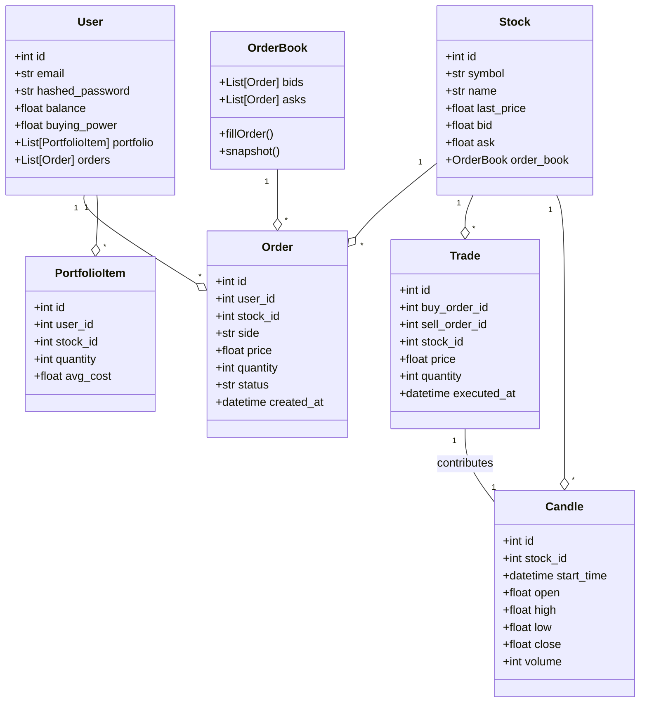
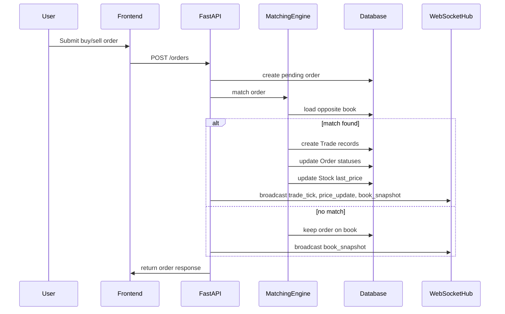
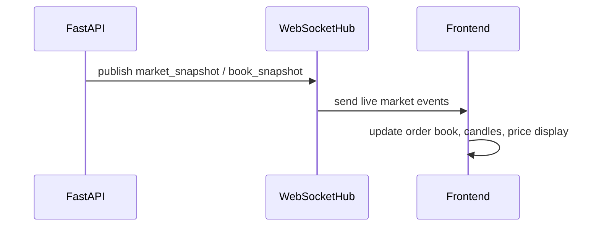
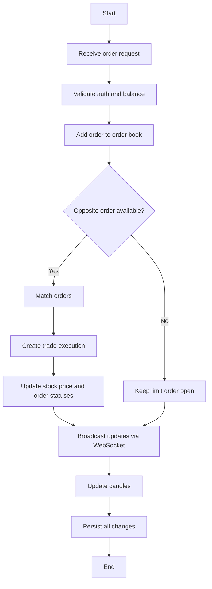
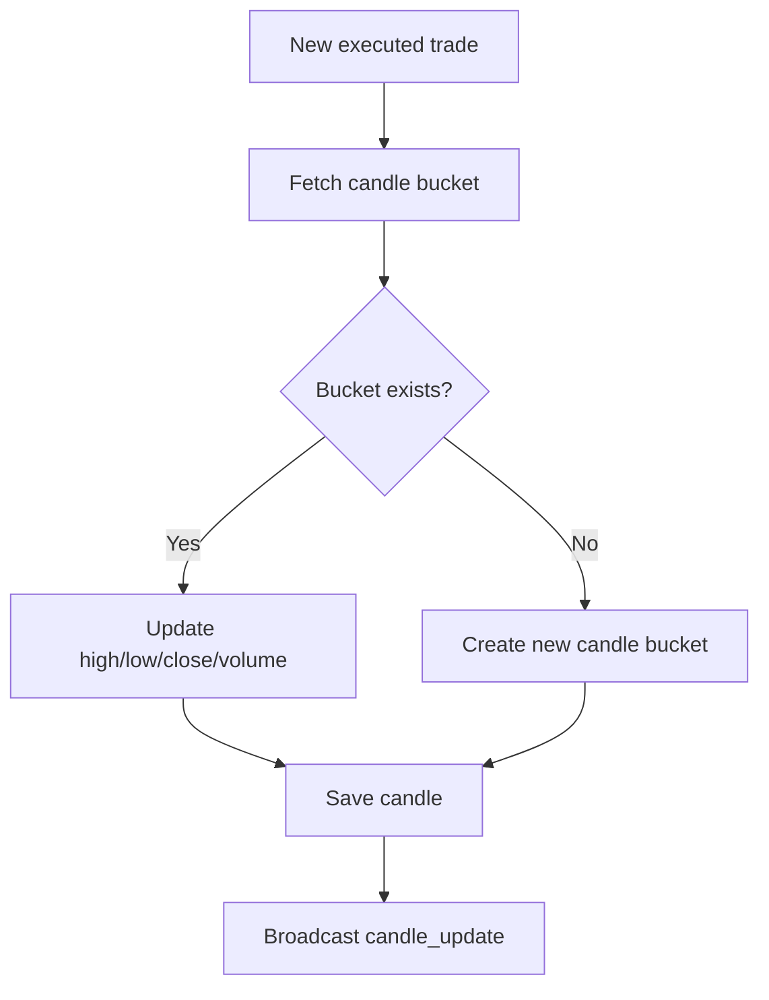
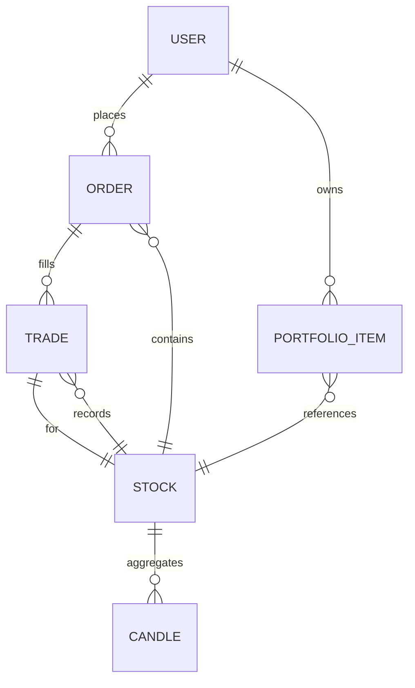
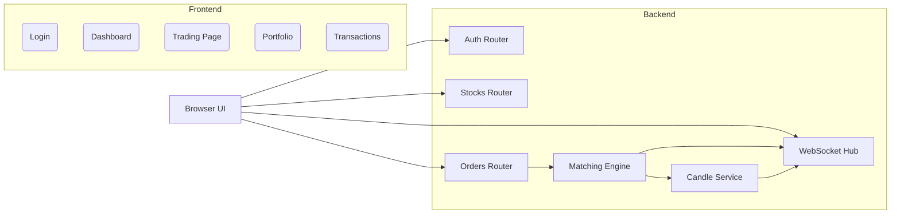

# TradeSphere

TradeSphere is a full-stack virtual trading simulator built with React, Vite, and FastAPI. It enables users to place buy/sell orders, track portfolio value, view live market events, and inspect real OHLC candle data generated from executed trades.

## What TradeSphere Does

- Provides account registration and JWT-based login.
- Shows a live stock feed with price updates and order-book snapshots.
- Executes market and limit orders through a backend matching engine.
- Aggregates executed trades into real candlestick bars per resolution.
- Tracks portfolio holdings, unrealized profit and loss, and transaction history.
- Includes a recovery bonus mechanic to give users additional virtual capital over time.

## High-Level Architecture

### System Overview

TradeSphere is a trading simulator built around a single truth: prices move only when a trade is executed. The system combines:
- React + Vite frontend for user interaction, dashboards, charts, and order entry
- FastAPI backend for auth, order routing, matching, trade execution, and market state
- SQL database for persistent stocks, orders, executed trades, candles, portfolios, and user state
- WebSocket event stream for real-time updates to all connected clients

### Use Case Model



### Class Diagram



### Sequence Diagrams

#### Order Placement and Execution



#### Market Data Delivery



### Activity Diagrams

#### Order Lifecycle



#### Candle Aggregation



### Database Model



### Component Architecture



### How Prices Change

TradeSphere only changes a stock’s displayed price when an actual trade is executed. The key rules are:
- Limit orders are placed into the buy or sell book and do not change price by themselves.
- The matching engine compares incoming orders against the opposite side of the book.
- When an incoming order matches one or more opposite orders, trade records are created at the agreed price.
- The executed trade updates `Stock.last_price` and the market quote.
- After execution, the system publishes a `trade_tick` event and a `price_update` event to all WebSocket clients.
- Candles are built from the same executed trades, so candlestick bars always reflect real volume and price movement.

### Price and Market Build Process

1. User submits an order through the trading UI.
2. Backend validates the request and saves the pending order.
3. Matching Engine loads current bids/asks and attempts a match.
4. If a match occurs, executed trade records are written.
5. Backend updates stock price and order statuses.
6. Candle Engine aggregates the trade into the correct OHLC bucket.
7. WebSocket Hub broadcasts:
   - `trade_tick`
   - `price_update`
   - `book_snapshot`
   - `candle_update`
8. Frontend receives events and redraws the order book, price badge, trade ticks, and charts.

### Frontend (React + Vite)

The frontend is a client-side SPA in the src folder:
- App.jsx for app structure, auth restore, navigation, and routes
- components/Login.jsx for login and registration flow
- components/Dashboard.jsx for summary cards and market overview
- components/Trading.jsx for live market feed, order entry, order book, and candle chart
- components/Portfolio.jsx for holdings and distribution
- components/Transactions.jsx for transaction history
- components/CandleChart.jsx for SVG candlestick rendering
- utils/axiosAuthSetup.js for auth interceptor
- utils/auth.js for local storage session helpers

### Backend (FastAPI)

The backend lives in backend/app:
- main.py for FastAPI startup, CORS, routers, and lifecycle tasks
- core/config.py for environment and settings loader
- core/database.py for SQLAlchemy engine and session setup
- core/security.py for hashing and JWT utilities
- models for users, stocks, portfolio, orders, transactions, trades, and candles
- schemas for request and response models
- routers for auth, stocks, portfolio, orders, trades, balance, and transaction endpoints
- services for matching engine, trade execution, candle aggregation, market maker, and WebSocket broadcast logic
- utils/init_db.py for database initialization and seeding

## Event Flow

1. User logs in and receives a JWT token.
2. Frontend requests stock, portfolio, balance, and transaction data.
3. Trading page opens a WebSocket to /ws/market for live events.
4. Orders are submitted to the backend and matched by the engine.
5. Executed trades publish trade ticks and update market prices.
6. The candle engine aggregates executed trades into OHLCV candles.
7. The WebSocket hub broadcasts updated market events and candles to clients.

## Project Structure

```text
TradeSphere/
├── backend/
│   ├── app/
│   │   ├── core/
│   │   │   ├── config.py
│   │   │   ├── database.py
│   │   │   └── security.py
│   │   ├── models/
│   │   ├── routers/
│   │   ├── schemas/
│   │   ├── services/
│   │   └── utils/
│   ├── .env
│   ├── requirements.txt
│   └── README.md
├── public/
├── src/
│   ├── components/
│   │   ├── Dashboard.jsx
│   │   ├── Landing.jsx
│   │   ├── Login.jsx
│   │   ├── Portfolio.jsx
│   │   ├── Trading.jsx
│   │   ├── Transactions.jsx
│   │   └── CandleChart.jsx
│   ├── utils/
│   │   ├── auth.js
│   │   └── axiosAuthSetup.js
│   ├── App.jsx
│   ├── App.css
│   └── main.jsx
├── package.json
├── vite.config.js
└── README.md
```

### Notes on structure
- `backend/app` contains the FastAPI application and domain modules.
- `src/components` contains the main React UI screens and trading widgets.
- `src/utils` contains auth helpers and Axios configuration.
- `public` contains static frontend assets.

## Setup

Frontend:

npm install
npm run dev

Backend:

cd backend
python -m venv venv
venv/Scripts/activate
pip install -r requirements.txt
uvicorn app.main:app --reload --host 127.0.0.1 --port 5000

## Environment

Create or update backend/.env with required variables such as DATABASE_URL, SECRET_KEY, ALGORITHM, ACCESS_TOKEN_EXPIRE_MINUTES, CORS_ORIGINS, and VERIFICATION_BASE_URL.

## API Endpoints

Method | Path | Description
--- | --- | ---
POST | /auth/register | Register a new user
POST | /auth/login | Log in and receive a JWT
GET | /auth/me | Get current authenticated user
GET | /stocks | List stocks with current pricing
GET | /stocks/{stock_id}/book | Get order book data for a stock
GET | /stocks/{stock_id}/candles | Get OHLCV candles for a stock
GET | /portfolio | Get authenticated user portfolio
GET | /transactions | Get authenticated user transactions
GET | /balance | Get authenticated user balance
GET | /balance/recovery-status | Get recovery cooldown status
POST | /orders | Submit a buy or sell order
GET | /healthz | Health check
WS | /ws/market | Live market event feed

## Notes

- The frontend currently uses a hard-coded API_BASE_URL pointing at the backend.
- CORS is open for development. Restrict CORS_ORIGINS before production deployment.
- Candle data is generated from executed trades and broadcast live via WebSocket updates.

## Common Commands

- npm run build — Build the frontend
- npm run lint — Run ESLint
- uvicorn app.main:app --reload --host 127.0.0.1 --port 5000 — Start backend

## Troubleshooting

- If the frontend cannot connect, confirm backend is running and API_BASE_URL matches the backend URL.
- If login fails, verify the JWT token is stored and the auth interceptor is sending it.
- If WebSocket updates stop, verify /ws/market is reachable.

## License

See LICENSE for license details.
